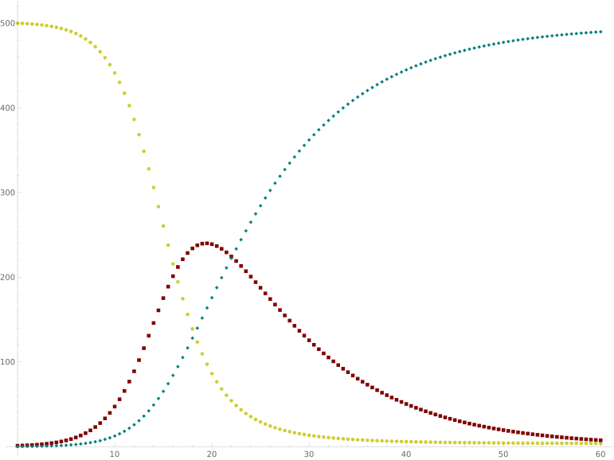

COVID prediction

## Brief description of the SIR model from [Wikipedia](https://en.wikipedia.org/wiki/Compartmental_models_in_epidemiology)

Compartmental models are a very general modelling technique. They are often applied to the mathematical modelling of infectious diseases. The population is assigned to compartments with labels – for example, S, I, or R, (Susceptible, Infectious, or Recovered). People may progress between compartments. 

The SIR model is one of the simplest compartmental models, and many models are derivatives of this basic form. The model consists of three compartments:

- S: The number of susceptible individuals. When a susceptible and an infectious individual come into "infectious contact", the susceptible individual contracts the disease and transitions to the infectious compartment.
- I: The number of infectious individuals. These are individuals who have been infected and are capable of infecting susceptible individuals.
- R: for the number of removed (and immune) or deceased individuals. These are individuals who have been infected and have either recovered from the disease and entered the removed compartment, or died. It is assumed that the number of deaths is negligible with respect to the total population. This compartment may also be called "recovered" or "resistant".

  
  |  |
  | :-- |
  | Spatial SIR model simulation. Each cell can infect its   eight immediate neighbors. |

This model is reasonably predictive for infectious diseases that are transmitted from human to human, and where recovery confers lasting resistance, such as measles, mumps, and rubella.

These variables (S, I, and R) represent the number of people in each compartment at a particular time. To represent that the number of susceptible, infectious, and removed individuals may vary over time (even if the total population size remains constant), we make the precise numbers a function of t (time): S(t), I(t), and R(t). For a specific disease in a specific population, these functions may be worked out in order to predict possible outbreaks and bring them under control.

As implied by the variable function of t, the model is dynamic in that the numbers in each compartment may fluctuate over time. The importance of this dynamic aspect is most obvious in an endemic disease with a short infectious period, such as measles in the UK prior to the introduction of a vaccine in 1968. Such diseases tend to occur in cycles of outbreaks due to the variation in number of susceptibles (S(t)) over time. During an epidemic, the number of susceptible individuals falls rapidly as more of them are infected and thus enter the infectious and removed compartments. The disease cannot break out again until the number of susceptibles has built back up, e.g. as a result of offspring being born into the susceptible compartment.

  
  |  |
  | :-- |
  | Yellow=Susceptible, Maroon=Infectious, Teal=Recovered |

## The SIR Model as a System of Differential Equations

The SIR model is given by

$`
\begin{align} 
  \begin{split} 
    S'&= -kSI\\ 
    I'&= kSI-qI\\
    R'&= qI
  \end{split}
\end{align}
`$

subject to $S+I+R=1$, where $S$ represents the proportion of the total population that is susceptible to the disease, $I$ represents the proportion of the total population that is infected, and $R$ represents the proportion of the total population that is recovered from the disease. At each time step, the susceptible ($S$) population will decrease as they interact with the infectious ($I$) population by a factor of $k$. Those that are newly infected will move from the susceptible ($S$) population to the infectious ($I$) population. A proportion ($q$) of the infectious ($I$) population will recover from the disease at each time step as well, hence moving from the infectious ($I$) population to the recovered ($R$) population. This simple model assumes that no one infected will die and will all eventually recover. It also assumes that those once recovered from the disease cannot be susceptible with it again. Each population is represented as a percentage of the total, hence $S+I+R=1$.

