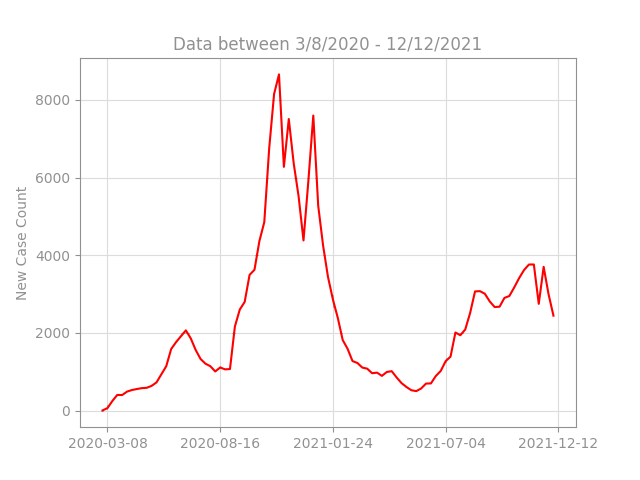
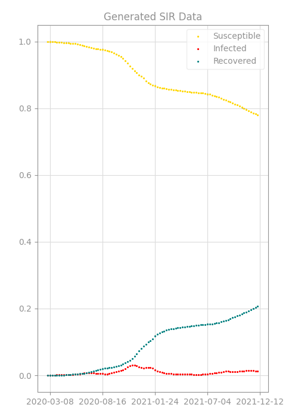
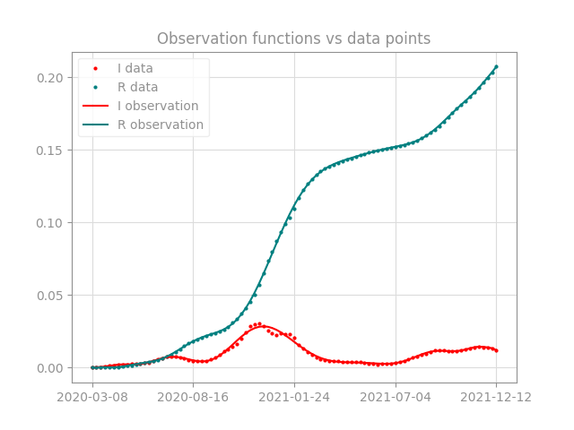
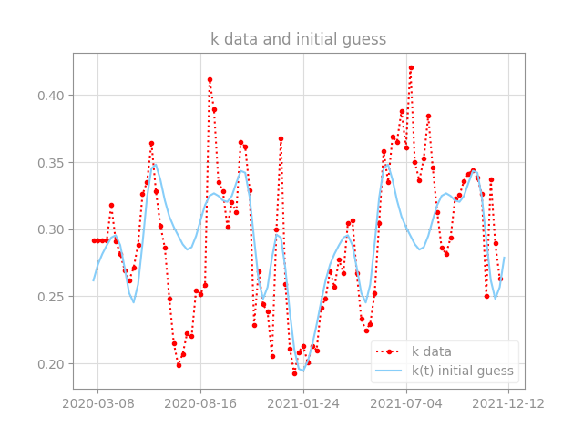
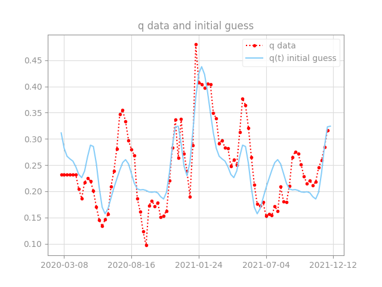

# Prediting COVID with Data Assimilation 

## Brief description of the SIR model from [Wikipedia](https://en.wikipedia.org/wiki/Compartmental_models_in_epidemiology)

Compartmental models are a very general modelling technique. They are often applied to the mathematical modelling of infectious diseases. The population is assigned to compartments with labels – for example, S, I, or R, (Susceptible, Infectious, or Recovered). People may progress between compartments. 

The SIR model is one of the simplest compartmental models, and many models are derivatives of this basic form. The model consists of three compartments:

- S: The number of susceptible individuals. When a susceptible and an infectious individual come into "infectious contact", the susceptible individual contracts the disease and transitions to the infectious compartment.
- I: The number of infectious individuals. These are individuals who have been infected and are capable of infecting susceptible individuals.
- R: for the number of removed (and immune) or deceased individuals. These are individuals who have been infected and have either recovered from the disease and entered the removed compartment, or died. It is assumed that the number of deaths is negligible with respect to the total population. This compartment may also be called "recovered" or "resistant".

<div align="center">
  
  |  |
  | :-- |
  | Spatial SIR model simulation. Each cell can infect its <br> eight immediate neighbors. |
</div>

This model is reasonably predictive for infectious diseases that are transmitted from human to human, and where recovery confers lasting resistance, such as measles, mumps, and rubella.

These variables (S, I, and R) represent the number of people in each compartment at a particular time. To represent that the number of susceptible, infectious, and removed individuals may vary over time (even if the total population size remains constant), we make the precise numbers a function of t (time): S(t), I(t), and R(t). For a specific disease in a specific population, these functions may be worked out in order to predict possible outbreaks and bring them under control.

As implied by the variable function of t, the model is dynamic in that the numbers in each compartment may fluctuate over time. The importance of this dynamic aspect is most obvious in an endemic disease with a short infectious period, such as measles in the UK prior to the introduction of a vaccine in 1968. Such diseases tend to occur in cycles of outbreaks due to the variation in number of susceptibles (S(t)) over time. During an epidemic, the number of susceptible individuals falls rapidly as more of them are infected and thus enter the infectious and removed compartments. The disease cannot break out again until the number of susceptibles has built back up, e.g. as a result of offspring being born into the susceptible compartment.

<div align="center">
  
  |  |
  | :-- |
  | Yellow=Susceptible, Maroon=Infectious, Teal=Recovered |
</div>

## The SIR Model as a System of Differential Equations

The SIR model is given by

$`
\begin{align} 
  \begin{split} 
    S\,'&= -kSI\\ 
    I\,'&= kSI-qI\\
    R\,'&= qI
  \end{split}
\end{align}
`$

subject to $S+I+R=1$, where $S$ represents the proportion of the total population that is susceptible to the disease, $I$ represents the proportion of the total population that is infected, and $R$ represents the proportion of the total population that is recovered from the disease. 

At each time step, the susceptible ($S$) population will decrease as they interact with the infectious ($I$) population by a factor of $k$. Those that are newly infected will move from the susceptible ($S$) population to the infectious ($I$) population. A proportion ($q$) of the infectious ($I$) population will recover from the disease at each time step as well, hence moving from the infectious ($I$) population to the recovered ($R$) population. This simple model assumes that no one infected will die and will all eventually recover. It also assumes that those once recovered from the disease cannot be susceptible with it again. Each population is represented as a percentage of the total, hence $S+I+R=1$.

## Calculus of Variation: Simple Case

In a simpler model shown in [SIR tutorial](SIR_tutorial.ipynb), $k$ and $q$ are assumed to be scalar values. The objective is to choose the model parameters $k$ and $q$, as well as the initial values for each population group, $S_0$, $I_0$, and $R_0$ such that it minimizes the cost functional $`J = \frac{1}{2} {\large\int}_\tau (I - I^{obs})^2 + (R - R^{obs})^2 dt`$ &mdash; the $L^2$-distance between the observation and the model prediction &mdash; using calculus of variation, specifically the adjoint method ($`\tau = \{t: 0 \leq t \leq T\}`$). 

To do this, we first augment the functional with a [Lagrange multiplier](https://en.wikipedia.org/wiki/Lagrange_multiplier). Moving the RHS of the SIR model and setting each equation to 0, the problem can be rewritten as $u = 0$, where $`u_1 = S\,' + kSI`$, $`u_2 = I\,' - kSI + qI`$, and $`u_3 = R\,' - qI`$. The augmented cost functional is then the Lagrangian, $J^{*} = J + \langle p, u \rangle$, where the adjoint variable $p$ is a Lagrange multiplier.

The augmented cost functional can then be fully written out as:

$`
\begin{align} 
  \begin{split} 
    J^{*} = &\frac{1}{2} {\large\int}_\tau (I - I^{obs})^2 + (R - R^{obs})^2 dt\\ 
    &+ {\large\int}_\tau p_S (S\,' + kSI) \,dt\\
    &+ {\large\int}_\tau p_I (I\,' - kSI + qI) \,dt\\
    &+ {\large\int}_\tau p_R (R\,' - qI) \,dt
  \end{split}
\end{align}
`$

We then take the first variation of the augmented functional $J^*$ to obtain:

$`
\begin{align} 
  \begin{split} 
    \delta J^{*} = &{\large\int}_\tau (I - I^{obs})\delta I + (R - R^{obs})\delta R \,dt\\ 
    &+ {\large\int}_\tau p_S \delta S\,' \,dt\\
    &+ {\large\int}_\tau p_S \delta (kSI) \,dt\\
    &+ {\large\int}_\tau p_I \delta I\,' \,dt\\
    &- {\large\int}_\tau p_I \delta (kSI) \,dt\\
    &+ {\large\int}_\tau p_I \delta (qI) \,dt\\
    &+ {\large\int}_\tau p_R \delta R\,' \,dt\\
    &- {\large\int}_\tau p_R \delta(qI) \,dt
  \end{split}
\end{align}
`$

Here, we are applying a small perturbation $\alpha$ with respect to the parameters $k$, $q$, $S_0$, $I_0$, and $R_0$, so $\delta u$ can be understood as $`\delta u = \lim\limits_{\alpha \to 0} {\Large\frac{\tilde{u} - u}{\alpha}}`$, where $\tilde{u}$ is the perturbed solution of $u$.

Note that $\delta S + \delta I + \delta R = 0$ and hence $\delta S = - \delta I - \delta R$.

Some of the integrals can be simplified using integration by parts:

$`
\begin{align}
  \begin{split}
    {\large\int}_\tau p_S \delta S\,' \,dt &= {\large\int}_\tau p_S\!' \delta S \,dt + p_S \delta S \, {\Huge\textbar}_\tau\\
    &= {\large\int}_\tau p_S\!' \delta S \,dt + p_S(T) \delta S_T - p_S(0) \delta S_0\\
    {\large\int}_\tau p_I \delta I\,' \,dt &= {\large\int}_\tau p_I\!' \delta I \,dt + p_I(T) \delta I_T - p_I(0) \delta I_0\\
    {\large\int}_\tau p_R \delta R\,' \,dt &= {\large\int}_\tau p_R\!' \delta R \,dt + p_R(T) \delta R_T - p_R(0) \delta R_0\\
    {\large\int}_\tau (p_S - p_I) \delta (kSI) \,dt &= {\large\int}_\tau (p_S - p_I) k(I\delta S + S \delta I) \,dt + {\large\int}_\tau (p_S - p_I) SI \delta k \,dt\\
    {\large\int}_\tau (p_I - p_R) \delta (qI) \,dt &= {\large\int}_\tau (p_I - p_R)(I \delta q + q \delta I) \,dt
  \end{split}
\end{align}
`$

Putting them all back together, we have:

$`
\begin{align} 
  \begin{split} 
    \delta J^{*} = &{\large\int}_\tau (I - I^{obs})\delta I + (R - R^{obs})\delta R \,dt\\ 
    &- {\large\int}_\tau p_S\!' \delta S \,dt - {\large\int}_\tau p_I\!' \delta I \,dt - {\large\int}_\tau p_R\!' \delta R \,dt\\
    &+ {\large\int}_\tau (p_S - p_I) k(I\delta S + S \delta I) + (p_S - p_I) SI \delta k \,dt\\
    &+ {\large\int}_\tau (p_I - p_R) q \delta I + (p_I - p_R) I \delta q \,dt\\
    &+ p_S(T) \delta S_T + p_I(T) \delta I_T + p_R (T) \delta R_T\\
    &- p_S(0) \delta S_0 - p_I(0) \delta I_0 - p_R (0) \delta R_0
  \end{split}
\end{align}
`$

Rearranging the terms gives us:

$`
\begin{align} 
  \begin{split} 
    \delta J^{*} = &{\large\int}_\tau (kI(p_S - p_I) - p_S\!')\delta S \,dt\\
    &+ {\large\int}_\tau (I - I^{obs} + kS(p_S - p_I) + q(p_I - p_R) - p_I\!') \delta I \,dt\\
    &+ {\large\int}_\tau (R - R^{obs} - p_R\!') \delta R \,dt\\
    &+ {\large\int}_\tau SI (p_S - p_I) \delta k \,dt\\
    &+ {\large\int}_\tau I (p_I - p_R) \delta q \,dt\\
    &+ p_S(T) \delta S_T + p_I(T) \delta I_T + p_R (T) \delta R_T\\
    &- p_S(0) \delta S_0 - p_I(0) \delta I_0 - p_R (0) \delta R_0
  \end{split}
\end{align}
`$

This gives us the following adjoint model:

$`
\begin{align}
  \begin{split}
    p_S\!' &= kI(p_S - p_I)\\
    p_I\!' &= I - I^{obs} + kS(p_S - p_I) + q(p_I - p_R)\\
    p_R\!' &= R - R^{obs}
  \end{split}
\end{align}
`$

with the boundary conditions $`p_S(T) = p_I(T) = p_R(T) = 0`$.

When the adjoint model is satisfied, we are left with the following:

$`
\begin{align} 
  \begin{split} 
    \delta J^{*} = &{\large\int}_\tau SI (p_S - p_I) \delta k \,dt\\
    &+ {\large\int}_\tau I (p_I - p_R) \delta q \,dt\\
    &- p_S(0) \delta S_0\\
    &- p_I(0) \delta I_0\\
    &- p_R (0) \delta R_0\\
    \quad\quad = & \nabla_m J \, \delta m
  \end{split}
\end{align}
`$

where $m$ is the vector containing all of the model parameters. This gives us the desired gradients for each of the input parameters:

$`
\begin{align} 
  \begin{split} 
    \nabla_{S_0} J &= -p_S(0)\\
    \nabla_{I_0} J &= -p_I(0)\\
    \nabla_{R_0} J &= -p_R(0)\\
    \nabla_{k} J &= SI (p_S - p_I)\\
    \nabla_{q} J &= I (p_I - p_R)
  \end{split}
\end{align}
`$

Using these gradient values, the parameters can be found numerically by using gradient descent algorithm. To achieve this, we must first find good initial guess values for the desired parameters $k$, $q$, $S_0$, $I_0$, and $R_0$. Because the algorithm is so reliant on having a good starting point, it may take a very long time, or even fail to converge with a poor initial guess. Hence, it is very important to come up with methods with available data that can help find a good initial guess. In some sense, the algorithm can be viewed as more of a fine-tuning mechanism rather than a robust learning machine. Once a good initial values for each parameters are found, they can be updated iteratively using the gradients found above.

$`
\begin{align}
  \begin{split}
    k &\leftarrow k - \lambda_k \nabla_{k} J\\
    q &\leftarrow q - \lambda_q \nabla_{q} J\\
    I_0 &\leftarrow I_0 - \lambda_{I_0} (\nabla_{I_0} J - \nabla_{S_0} J)\\
    R_0 &\leftarrow R_0 - \lambda_{R_0} (\nabla_{R_0} J - \nabla_{S_0} J)\\
    S_0 &\leftarrow 1 - I_0 - R_0
  \end{split}
\end{align}
`$

Each $\lambda$ represents the learning rate at which the parameters are updated. The learning rates of each parameter may be the same, or they may vary for more optimal learning. In addition, we assume the data starts at the beginning of the infection, hence $R_0$ should always be 0. This simplifies the parameters for the initial guess, only having to rely on the $I_0$ value.

## [COVID Data - SIR Model](SIR_COVID1.ipynb)



In this project, we apply the data assimilation techinques outlined in the previous section on a real world data, specifically the COVID-19 data from the Salt Lake County. This data is open source and is availalbe online. The objective of this project is to use the Salt Lake County COVID data to see if the final model could predict the holiday spike of COVID cases that occured in the weeks between December of 2021 and January of 2022. 

### Details of the data

The data used for COVID modeling is the summary of new cases per week from the Salt Lake County. This data simply tells us how many new COVID cases occurred during a specified week, between March of 2020 all the way up til September of 2023. For this project, however, only the data up til December 12th of 2021 was used as the training data, and the 5 weeks between December 19th of 2021 to January 19th of 2022 was used as the test data. There was an abnormally high spike in COVID cases during that time as a result of winter holidays, and the task was to see whether it was possible to predict that given the potential spike that happened the year before. 



### SIR Model 

For this task, the same SIR model that was outlined in the previous section is used to model the Salt Lake County population with one small change: the parameters $k$ and $q$ are now treated as functions of time, $k(t)$ and $q(t)$ instead as a scalar value. Now, in order to use the SIR model, we must have datapoints for the $S$, $I$, and $R$ populations. However, since we only have data for the new cases of a given week, we must generate the 3 population data. 

Since the new cases data only those that are newly infected in a specified week, it can be interpreted as the $`-S\,'`$ data. From this, we can generate the desired $S$, $I$, and $R$ data with a few simple assumptions. The first assumption we make is that the total population of the Salt Lake County is 1 million. This is a round down estimate of the 2020 [census](https://www.census.gov/quickfacts/fact/table/saltlakecountyutah/PST045224). The next assumption we make is those that are infected will remain infected for 4 weeks, after which they will be recovered. Finally, those once recovered will be resilient, and hence will not be susceptible to the diseases again. With these assumptions, the 3 population data can be gerenated as follows:

```
P_total = 1e6

I_data = np.array([sum(case_count_data[:k]) for k in range(1, 4)] + \
                  [sum(case_count_data[k:k+4]) for k in range(len(case_count_data) - 3)])
R_data = np.array([0, 0, 0] + [sum(case_count_data[:k]) for k in range(len(case_count_data) - 3)])

I_data = I_data / P_total
R_data = R_data / P_total
S_data = 1 - I_data - R_data
```

Using the generated data, we must now create a callable function in the time domain as our observation functions, since we need to have $I^{obs}(t)$ and $R^{obs}(t)$ for our cost functional $`J = \frac{1}{2} {\large\int}_\tau (I - I^{obs})^2 + (R - R^{obs})^2 dt`$. This function should match the behavior from the data as closely as possible, while not being too ill-conditioned. To do this, we model the observation functions as an $n^{\text{th}}$-degree polynomials, and fit it to our data, i.e. $`I^{obs}(t) = a_n t^{n} + a_{n-1} t^{n-1} + ... + a_1 t + a_0`$ and similarly for $R^{obs}$. We chose $n=20$. 

<div align="center">
  
  
</div>

Next, we attempt to model the parameter functions $k(t)$ and $q(t)$. These functions are modeled using Fourier bases functions, with periodicity of 52. This is based on the assumption that different times of the year will affect the infection rate, but the same trend will continue from year to year. Hence, the functions will look as follows:

$`
k(t) = c + {\Large\sum}_{n=1}^N a_n \text{cos}(2\pi nt/52) + b_n \text{sin}(2\pi nt/52)
`$

and similarly for $q(t)$. 

### Strategies for finding a good initial guess

In order for the algorithm to have a good fit, we must have a good initial guess for these two functions. This can be done by generating data points for $k(t)$ and $q(t)$ which can be solved for in the SIR model.

$`
\begin{align}
  \begin{split}
    S\,' = -k(t)SI &\implies k(t) = -\frac{S\,'}{SI}\\
    R\,' = q(t)I &\implies q(t) = \frac{R\,'}{I}
  \end{split}
\end{align}
`$

To satisfy the RHS of the equations above, the $S\,'$ and $R\,'$ data are generated using the existing $S$ and $R$ data. This is done by taking the difference between the values of the current week and the previous week, for all weeks. We then generate the data points for $k(t)$ and $q(t)$ by following the formula above. Below is a code snippet that shows how this is done with Numpy arrays:

```
S_t = S_data[1:] - S_data[:-1]
R_t = R_data[1:] - R_data[:-1]

# The behavior of the first couple weeks are normalized since R and I values are (close to) 0
k_data = -S_t / (S_data[1:]*I_data[:-1])
k_data[:4] = np.mean(k_data[5:])
q_data = R_t / I_data[1:]
q_data[:6] = np.mean(q_data)
```

We then numerically fit a Fourier bases function to the data to find a decent initial guess functions for the parameters $k(t)$ and $q(t)$. This is done using the curve_fit function from the scipy.optimize package. 

<div align="center">

   
</div>

Next, we want to find a good initial guess for the parameters $S_0$, $I_0$, and $R_0$. This is done through more of a trial and error, where we pick a reasonable initial values and run them through the SIR model. Since we have generated a close approximation for the $k(t)$ and $q(t)$ parameter functions, a decent initial guess should yield a decent fit with the data. The differential equation can be numerically solved using the solve_ivp function from the scipy.integrate package. 

